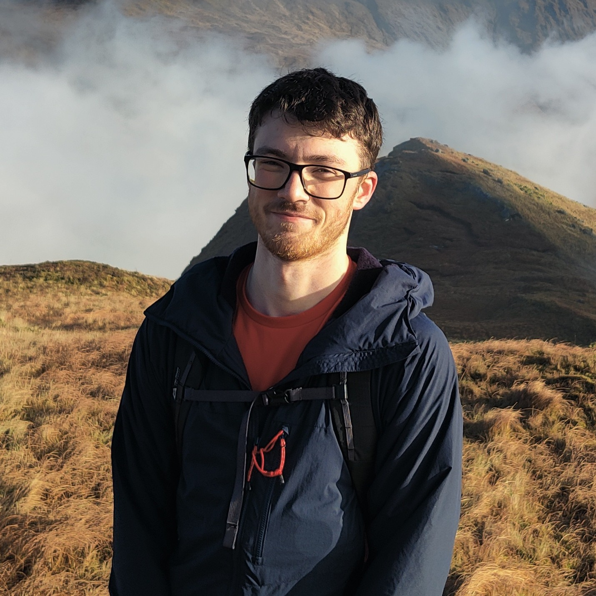

I am a PhD student at the [Centre for mathematical Plasma Astrophysics (CmPA)](https://wis.kuleuven.be/CmPA), KU Leuven, supervised by [Prof. Rony Keppens](https://homes.esat.kuleuven.be/~keppens/).

My research focuses on **solar coronal condensations**, including prominence formation and coronal rain, which I study with large-scale magnetohydrodynamic (MHD) simulations.
I am also interested in MHD spectral theory and computational astrophysics more broadly.

I am an active developer of two open-source codes:

- **[AGILE](https://github.com/amrvac/AGILE-experimental)** — a GPU-accelerated MHD code built on the [MPI-AMRVAC](http://amrvac.org) framework.
- **[Legolas](https://legolas.science)** — an MHD spectroscopy code.

**Contact:** [adrian.kelly@kuleuven.be](mailto:adrian.kelly@kuleuven.be) &middot; [ADS](https://ui.adsabs.harvard.edu/search/q=orcid%3A0009-0006-8524-008X&sort=date+desc) &middot; [ORCID](https://orcid.org/0009-0006-8524-008X) &middot; [GitHub](https://github.com/akelly810)
