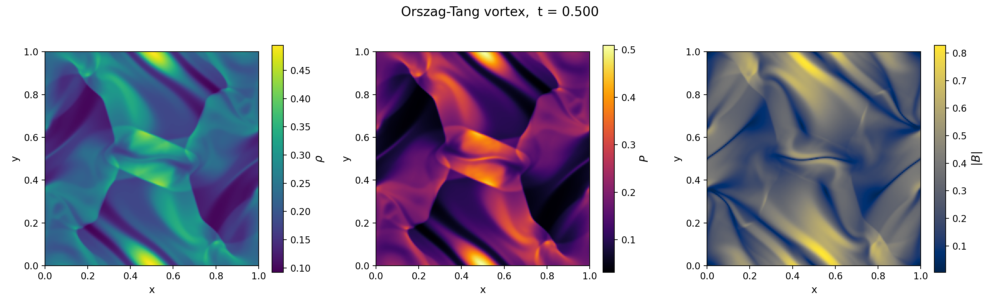
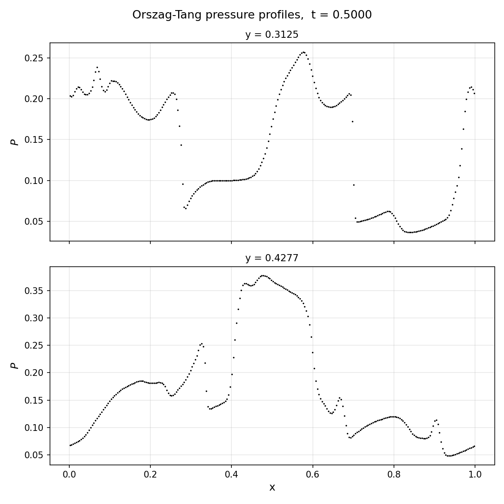
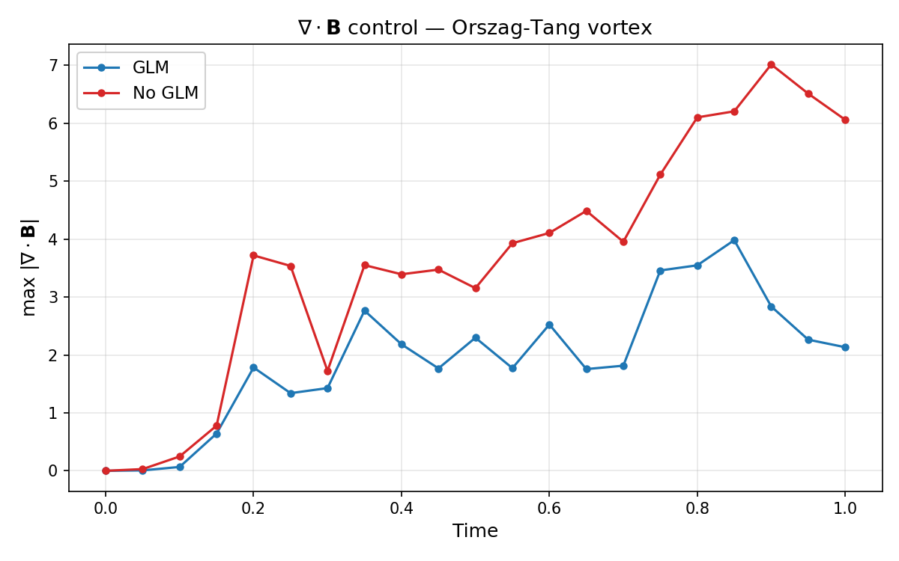

[Back to all tests](../tests)

## Description
The Orszag-Tang vortex is a standard 2D MHD test problem that tests multi-dimensional MHD shock interactions, current sheet formation, and divergence control

Since AGILE is a fully 3D code, we run this as an extruded 2D problem: the initial conditions are uniform in the $z$-direction and the domain is only a single block (16 cells here) deep. Results are taken from a 2D slice in the $xy$-plane.

## AGILE setup
For our $[0,1]^3$ domain, we use the following initial conditions:

$$
\begin{align*}
\rho &= \frac{25}{36\pi}  \\
p &= \frac{5}{12\pi}  \\
\mathbf{v} &= \left[-\sin(2\pi y),\; \sin(2\pi x),\; 0\right]  \\
A_z &= \frac{b_0}{2\pi}\left[\tfrac{1}{2}\cos(4\pi x) + \cos(2\pi y)\right] \\
\mathbf{B} &= \left[-b_0\sin(2\pi y),\; b_0\sin(4\pi x),\; 0\right]
\end{align*}
$$

with $b_0 = 1/\sqrt{4\pi}$. Note that these initial conditions give $c_s^2 = \gamma p / \rho = 1$, a standard normalisation for this problem.

$\mathbf{A}$ is the magnetic vector potential, from which $\mathbf{B}$ is initialised analytically via $\mathbf{B} = \nabla \times \mathbf{A}$; the vector potential form is given here for reference and for future constrained transport (CT) runs. The simulations shown here instead use GLM divergence cleaning (Dedner et al., 2002).

| Parameter | Value |
|-----------|-------|
| Domain | $[0, 1]^3$ |
| Resolution | $256 \times 256$ ($\times 16$) |
| Boundary conditions | Periodic |
| $\gamma$ | $5/3$ |
| Flux scheme | TVDLF |
| Reconstruction | MUSCL (Van Leer limiter) |
| Final time | $t = 1$ |

## Results

### 2D maps at $t = 0.5$

{:style="width:100%"}
*Density $\rho$, pressure $p$, and magnetic field magnitude $|\mathbf{B}|$ at $t = 0.5$ on a $256^2$ grid with TVDLF and Van Leer reconstruction.*

### Pressure profiles at $t = 0.5$

*Pressure along horizontal slices at $y = 0.3125$ and $y = 0.4277$ at $t = 0.5$. These can be compared with many standard solutions such as [ATHENA (J. Stone)](https://www.astro.princeton.edu/~jstone/Athena/tests/orszag-tang/pagesource.html), amongst others.*

### Divergence cleaning

*Evolution of $\max|\nabla\cdot\mathbf{B}|$ over time with and without GLM divergence cleaning.*

## References

- Orszag, S. A. & Tang, C.-M. (1979), *J. Fluid Mech.*, 90, 129
- Dedner, A., Kemm, F., Kröner, D., et al. (2002), *J. Comput. Phys.*, 175, 645. [DOI](https://doi.org/10.1006/jcph.2001.6961)
- [ATHENA Orszag-Tang test (J. Stone)](https://www.astro.princeton.edu/~jstone/Athena/tests/orszag-tang/pagesource.html)
- [FLASH Orszag-Tang test](https://flash.rochester.edu/site/flashcode/user_support/flash_ug_devel/node192.html#SECTION010122000000000000000)
